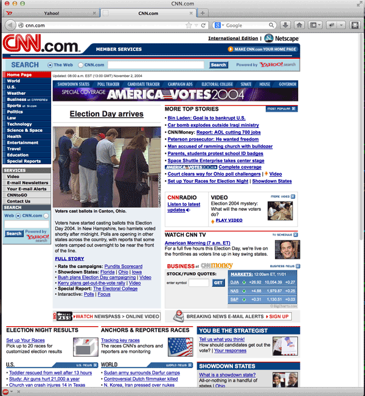

Wayback-Machine-Machine
=======================

What
----

Go back in time. The wayback-machine-machine is a proxy server that proxies data through
the [Wayback Machine](https://archive.org/help/wayback_api.php). 

You can enter any URL you like into your browser and view the Internet
as though it were a different year.



Usage
-----

Start the proxy server:

```bash
git clone git@github.com:STRML/wayback-machine-machine.git
cd wayback-machine-machine
npm install
node app --date 2006-03-01 # View the web as of Mar 1st, 2006
``` 

Configure your browser to use an *HTTP Proxy* at `localhost:4080`.

Enjoy the information superhighway!
